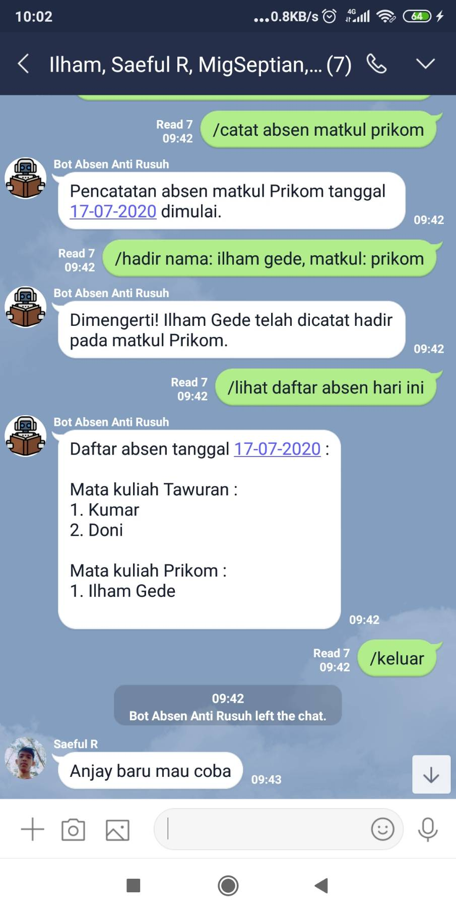

# Line Bot Attendance Manager

This bot is used for the purpose of recording student absences in order to avoid overwriting the names of other students.

## Screenshot



## Requirement

> 1.  npm v6.14.8
> 2.  Node.js v12.19.0
> 3.  mongoose v5.9.24

## Installation

1. Open terminal, then execute this command :

```
git clone https://gitlab.com/DonzTea/online-attendance-line-bot.git
```

2.  Enter the cloned project with this command :

```
cd online-attendance-line-bot
```

3.  Install packages and dependencies with this command :

```
npm install
```

4.  Rename `.env.example` file to `.env`

5.  Open `.env` file, set environment variables as you wish, then save.

